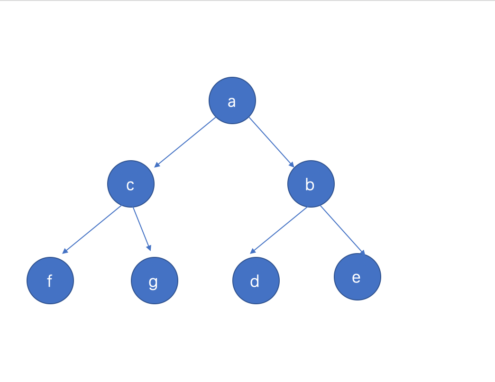
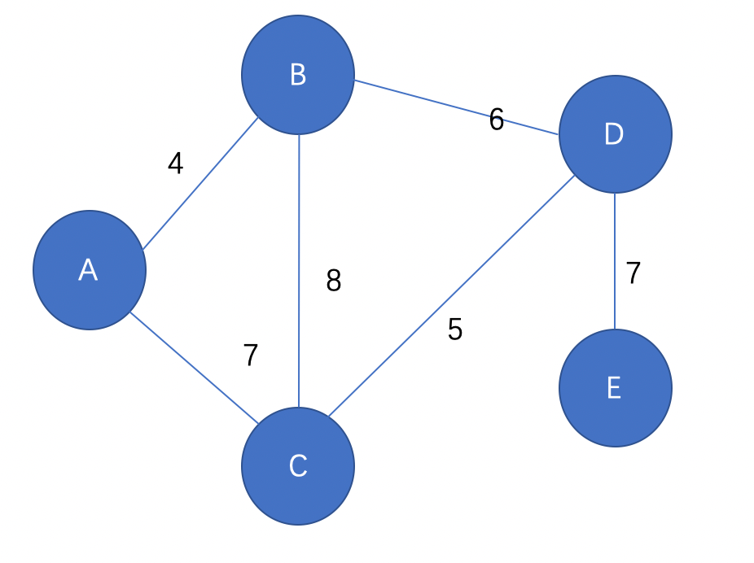

# 数据结构与算法有什么关系？

- 可以容纳数据的结构被称为数据结构。
- 算法是用来对数据结构进行处理的方法。
- 数据结构是静态的， 算法是动态；

# 线性数据结构之数组

一维数据结构：（线性数据结构） 线性的数据结构强调存储与`顺序`

一维是个线， 二维是个面， 三维是个立方体， 四维带时间；

### 数组

1. 数组是定长的； 长度不够的时候会出现数组扩容；  我们在js使用数组时没有定长, 因为js引擎帮我们实现了;
	如： 一开始数组长度是8； 放1～8； 如果加个9； 操作系统重新分配一个长度为16长度的数组（可能会分配16长度）， 把1～8复制过来 把9加上


- 数组特性
	1. 存储在物理空间是连续的；
	2. 底层的数组长度是不可变的；长度不够时数组会进行扩容；
	3. 数组的变量， 指向了数组的第一个元素的位置； ` let a = [1,2,3,4] `; 变量a指向数组的起点, (首地址);  a[1]、a[2];  方括号表示数组的偏移。 操作系统小知识： **通过偏移查询数据的性能最好**；

优点: 
查询性能好； 指定查询某个位子；

缺点： 
1. 因为空间必须是连续的，所以如果数组比较大，当系统的空间碎片比较多的时候， **容易存不下**。（空间碎片：小的零碎的不连续的空间）；存不下时 系统会整理空间, 会耗费CPU、磁盘的读写; 尽量避免数组太大;
2. 因为数组的长度是固定的，所以数组的内容难以被添加和删除；


# 线性数据结构之链表（不特殊说明都是单链表）

双链表能实现的东西单链表都能实现, 而且双链表贮存两个引用, 极度浪费内存空间;

链表结构： a、b (链表是带有封装性质的数据结构)

a里面存了a的值和b的引用； (一部分存数据一部分存下一个数的引用)

```js
var a = {
	value: 1,
	next: b // 存了b的引用
}

var b = {
	value: 2,
	next: c
}


//a.next === b
```

我想传递一个链表， 我必须传递链表的根节点。（**每一个节点， 都认为自己是根节点**）

> 链表只记录自己和下一个节点的引用；

**链表的特点**
1. 空间上不是连续的；链表中的元素在内存中不是连续放置的;
2. 每存放一个值， 都要多开销一个引用空间

优点：
1. 只要内存只够大，就能存的下，不用担心空间碎片；
2. 链表的添加和删除非常容易；添加和删除不需要移动其他元素;

缺点：
1. 查询速度慢（指定查询某个位置）不是连续的; 在访问链表中的某个元素时也需从头迭代;不像数组一样直接访问;
2. 链表每一个节点都需要创建一个指向next的引用， 浪费一些空间。 当节点内数据越多的时候， 这部分多开销的内存影响越少；

```js
// 创建一个链表

function Node(value) {
	this.value = value;
	this.next = null;
}

var a = new Node(1);
var b = new Node(2);
var c = new Node(3);
var d = new Node(4);

a.next = b;
b.next = c;
c.next = d;
d.next = null

```

# 线性数据结构的遍历

遍历： 将一个集合中的每一个元素进行获取并查看


**循环遍历**
```js
var arr = [1,2,3,4,5,6,7,8];

function bianArr(arr) {
    if (arr == null) return; // 算法必须要有严谨性判断， 算法报错了一分没有；
    for (var i = 0 ; i < arr.length ; i ++) {
        console.log(arr[i]);
    }
}

function Node(value) {
	this.value = value;
	this.next = null;
}
// 创建一个个节点
var node1 = new Node(1)
var node2 = new Node(2);
var node3 = new Node(3);
var node4 = new Node(4);

// 组合成链表
node1.next = node2;
node2.next = node3;
node3.next = node4;
node4.next = null;

// 循环遍历链表
function bianLink(root) {
	var temp = root;
	while (true) { // 因为不知道链表的长度用while循环, 数组知道循环的次数
		if(temp !== null) {
			console.log(temp.value);
		} else {
			break
		}
		temp = temp.next;
	}
}


function printListNode(headNode) {
	let head = headNode;
	while(head.next) {
		console.log(head.value);
		head = head.next;
	}

	console.log(head.value); // 打印最后一个节点
}
```

### 增加

- 在尾部新增链表

```js

function Node(value) {
	this.value = value;
	this.next = null;
}

function addAtLast(headNode, value) {
	const newNode = new Node(value);
	const head = headNode;
	while(head.next) {
		head = head.next // 找到链表的尾
	}
	head.next = newNode;
}

```

### 删除

- 删除任意一个节点

```js
function deleteNOde(headNode, index) {
	let i = 0;
	let frontHead = headNode; // 上一个节点
	let head = headNode; // 当前节点
// 当删除头部节点时
	if(index === 0) {
		headNode = headNode.next;
		return headNode;
	}
	while(head.next) {
		i++;
		frontHead = head
		head = head.next
		if(i === index) {
			frontHead.next = head.next
			return headNode
		}
	}
	return headNode; // 删除超过链表长度的节点
}

```

### 查找

- 按value查找, 返回第一个匹配的节点的索引, 找不到返回 -1;

```js

	function selectNode(headNode, value) {
		let i = 0;
		let head = headNode;
		if(head.value === value) {
			return 0
		}

		while(head.next) {
			i ++;
			head = head.next;
			if(head.value === value) {
				return i
			}
		}
		return -1;
	}

```

### 链表的插入

- 插入节点到链表的指定位置;

```js
	function insert(headNode, value, index) {
		let i = 0;
		let nextHead = headNode;
		let head = headNode;
		const newNode = new Node(value);
		if(index === 0) {
			newNode.next = headNode
			return headNode;
		}

		while(head.next) {
			i ++;
			head = nexHead;
			nextHead= head.next;
			if(i === index) {
				newNode.next = nextHead;
				head.next = newNode;
				return headNode;
			}
		}
		return headNode;
	}


```

### 修改

— 改某一个节点的内容

```js
	function changeNode(headNode, oldValue, newValue) {
		let newHeadNode = headNode;
		let index = selectNode(newHeadNode, oldValue); // 查找一个节点 返回索引
		newHeadNode = deleteNode(newHeadNode, index)
		newHeadNode = insertNode(newHeadNode, index, newValue)
	}
	// 结合查找selectNode、删除deleteNode、插入insertNode函数即可实现

```

**递归遍历**

循环遍历的性能最好， 递归遍历数组不推荐， 递归遍历链表推荐

```js
function Node(value) {
	this.value = value;
	this.next = null;
}

var node1 = new Node(1)
var node2 = new Node(2);
var node3 = new Node(3);
var node4 = new Node(4);

node1.next = node2;
node2.next = node3;
node3.next = node4;
node4.next = null;

function bianLink(root) {
	if(root === null) return; // 递归的关键点是找出口；
	console.log(root.value);
	bindLink(root.next)
}


// 递归遍历数组  不推荐
let arr = [1,2,3,4,5,6,7];

function bianArr(arr, i) {
	if(arr === null || arr.length <= i) return;
	console.log(arr[i]);
	bianArr(arr, i + 1)
}

bianArr(arr, 0)

```

# 链表的逆置

先找到最后一个节点，把最后一个节点指向倒数第二个节点；以此类推； 第一个节点指向空；

```js
function Node(value) {
	this.value = value;
	this.next = null;
}

var node1 = new Node(1)
var node2 = new Node(2);
var node3 = new Node(3);
var node4 = new Node(4);

node1.next = node2;
node2.next = node3;
node3.next = node4;
node4.next = null;

// 递归 -- 链表的反转
function reverseNode(root) {
	if(root.next.next === null) { // 当前的节点是倒数第二个节点；
		root.next.next = root; // 把最后一个节点指向自己（倒数第二个节点）
		return root.next; // 返回最后一个节点， 逆置后的根节点；
	} else {
		let result = reverseNode(root.next);
		root.next.next = root; // 让下一个节点指向自己
		root.next = null; // 自己指向空  主要是第一个节点必须指向空
		return result;

	}
}


// 循环 -- 单链表反转  循环把head 指向frontHead
function reverseNode1(headNode) {
	if(headNode === null || headNode.next === null) {
		return headNode;
	}

	let frontNode = null;
	let head = headNode;
	let nextNode = head.next;

	while(head.next) {
		head.next = frontNode;
		frontNode = head;
		head = nextNode;
		nextNode = nextNode.next;
	}

	head.next = frontNode
	return head;
}

```

# 排序算法

排序的本质不是比较大小， 本质是比较和交换

术语解释：

n: 数据的规模

**稳定：** 两个相等的值在排序前后相对位置是否改变，如果不会改变则成为稳定，反之为不稳定

排序方式：
**内排序**In-place是指所有操作都在内存中完成；
**外排序**Out-place把数据放在磁盘中，排序通过磁盘和内存的数据传输才能进行；

https://zhuanlan.zhihu.com/p/50479555  复杂度的说明

时间复杂度：算法执行所消耗的时间； o, 不是很准确, 因为时间还和电脑的硬件、数据量的大小等客观因素相关;

空间复杂度：算法执行所需的内存空间的大小；s

# 冒泡排序

两层循环,比较相邻的元素。如果第一个比第二个大，就交换它们两个, 一轮循环下来最大的数跑到数组最后面;

```js

var arr = [4,1,6,9,3,2,8,7];

// 比较之后需要得出是否需要交换
function compre(a, b) {
	if(a < b) return false;
	else return true;

}

//将数组中ab位置里的值进行交换
function exchange(arr, a, b) {
	let temp = arr[a];
	arr[a] = arr[b];
	arr[b] = temp;
}

//这个sort可以是冒泡排序也可以是选择排序也可以是其它排序。
function sort(arr) {

	for(let i = 0; i < arr.length; i ++) {
		for(let j = 0, len = arr.length - 1; j < len - i; j ++) { // 每次排序是把最大的数放到数组的最后面  每次循环后最后的两个数不用比较
				if(compre(arr[j], arr[j + 1])) {
					exchange(arr, j, j + 1)
				}
			}
	}
	
}

sort(arr);

console.log(arr)

// 优化后的冒泡排序
function bubbleSort(arr) {
	for(let i = 0, len = arr.length; i < len; i ++) {
		let flag = true; // 维护一个flag 如果内层循环一次没有出现 数的交换说明此时已经排序好了， 就没有必要继续循环排序了
		for(let j = 0, len = arr.length - 1 -i; j < len; j ++) { // 这里的减 i 是说明每一次外层循环好， 数组的最后一位已经是最大值了；
			if(arr[j] > arr[j + 1]) {
				flag = false;
				let temp = arr[j];
				arr[j] = arr[j + 1];
				arr[j + 1] = temp;
			}
		}

		if(flag) break;
	}
	return arr;
}


function bubbleSort(arr) {
	if(!Array.isArray(arr)) {
		throw TypeError(`arguments: ${arr} must be an Array`);
	}
	let len = arr.length;
	if(len === 0 || len === 1) return arr;
	for(let i = 0; i < len; i ++) { // 是要循环的次数
		let flag = true;
		for(let j = 0; j < len - 1 - i; j ++) { // 每次循环把最大的放到最后面  len - 1 是因为arr[j + 1]才有值
			if(arr[j] > arr[j + 1]) {
				let temp = arr[j];
				arr[j] = arr[j + 1];
				arr[j + 1] = temp
				flag = false;
			}
		}

		if(flag) return arr; // 内层循环中若有一次不交换, 则已满足升序;
	}

	return arr;
}
```

# 选择排序

### 任何一个排序算法没有优劣之分， 只有是否适合的场景，

表现最稳定的排序算法之一，因为无论什么数据进去都是O(n2)的时间复杂度，所以用到它的时候，数据规模越小越好。唯一的好处可能就是`不占用额外的内存空间`了吧

- 冒泡排序适合越有序数据集， 
- 选择排序适合比较一般乱的数据集， 
- **快速排序适合数据量大且越混乱的数据集**

工作原理：首先在未排序序列中找到最小（大）元素，存放到排序序列的起始位置，然后，再从剩余未排序元素中继续寻找最小（大）元素，然后放到已排序序列的末尾。以此类推，直到所有元素均排序完毕

```js

function compare(a, b) {
	if(a < b) return false;
	else return true;
}

function exchange(arr, a, b) {
	let temp = arr[a];
	arr[a] = arr[b];
	arr[b] = temp;
}

// 选择排序内层循环， 每一圈选出最大的， 然后放在数组的后面
function sort(arr) {
	for(let i = 0; i < arr.length; i ++) {
		let maxIndex = 0;
		for(let j = 0; j < arr.length - i; j ++) {
			if(compare(arr[j], arr[maxIndex])) {
				maxIndex = j
			}
		}
		exchange(arr, maxIndex, arr.length - 1 -i) // 
	}
}


function selectionSort(arr) {
	if(!Array.isArray(arr)) {
		throw TypeError(`arguments: ${arr} must be an Array ~`);
	}
	let len = arr.length;
	if(len === 0 || len === 1) return arr;

	for(let i = 0; i < len - 1; i ++) {
		let maxIndex = 0;
		for(let j = 0; j < len - i; j ++) {
			if(arr[j] > arr[maxIndex]) {
				maxIndex = j; // 内层循环找到数组最大值的索引
			}
		}
		let temp = arr[maxIndex];
		arr[maxIndex] = arr[len - 1 - i];
		arr[len - 1 - i] = temp; 
	}
	return arr;
}


```


# 插入排序

思想: 通过构建有序序列，对于未排序数据，在已排序序列中从后向前扫描，找到相应位置并插入。

实现过程使用双层循环，外层循环对除了第一个元素之外的所有元素，内层循环对当前元素前面有序表进行`待插入位置查找`，并进行移动

```js

function insertSort(arr) {
	if(!Array.isArray(arr)) {
		throw TypeError(`arguments: ${arr} must be an Array ~`);
	}
	let len = arr.length;
	let preIndex, current;
	if(len === 0 || len === 1) return arr;
	for(let i = 1; i < len; i ++) {
		preIndex = i - 1;
		current = arr[i]
		
		while(preIndex >= 0 && current < arr[preIndex]) {
			arr[preIndex + 1] = arr[preIndex]; // 把前面已排序的数往后移
			preIndex -- // 查找插入的位置
		}
		arr[preIndex + 1] = current;

	}
	return arr;
}

```
每个内循环开始的时候，arr[i] === current === arr[preIndex + 1]，所以在内循环首次时 arr[preIndex + 1] = arr[preIndex] 的时候不必担心 arr[i] 的值丢失；


# 快速排序
思想：
（1）在数据集之中，选择一个元素作为"基准"（pivot）。
（2）所有小于"基准"的元素，都移到"基准"的左边；所有大于"基准"的元素，都移到"基准"的右边。
（3）对"基准"左边和右边的两个子集，不断重复第一步和第二步，直到所有子集只剩下一个元素为止。

# 简单快速排序

```js
let arr = [4,1,6,9,3,2,8,7];

// 简易版 这种会创建很多数组
function quickSort(arr) {
	if(arr.length <= 1) return arr;
	let leader = arr[0];
	let left = [];
	let right = [];
	for(let i = 1; i < arr.length; i ++) {
		if(arr[i] < leader) {
			left.push(arr[i])
		}else {
			right.push(arr[i])
		}
	}
	left = quickSort(left);
	right = quickSort(right);
	left.push(leader);
	return left.concat(right)

}

const newArr = quickSort(arr);

console.log(newArr);

```

# 标准快速排序(双指针快排)
（1）、确定基准数
我们把数组的第一个元素作为基准数
（2）、确定哨兵
用两个变量i和j，分别指向序列最左边和最右边。我们为这两个变量起个好听的名字“哨兵i”和“哨兵j”。刚开始的时候让哨兵i指向序列的最左边，让哨兵j指向序列的最右边。

首先哨兵j开始出动。哨兵j一步一步地向左挪动（即j--），直到找到一个小于基准的数停下来。接下来哨兵i再一步一步向右挪动（即i++），直到找到一个数大于基准的数停下来。此时交换位子； 继续移动i和j知道 i等于j；  我们把基准数和i进行交换； 最后对基准两边的数进行递归处理；

```js
function swap(arr, a, b) {
	let temp = arr[a];
	arr[a] = arr[b];
	arr[b] = temp;
}

// begin、end 作为数组的排序的开始和结束  前闭后开 [ )
function quickSort(arr, begin, end) {
	if(begin >= end - 1) return;
	let left = begin;
	let right = end;

	do {
		do left ++; while(left < right && arr[left] < arr[begin]);
		do right --; while(left < right && arr[right] > arr[begin]);

		if(left < right) {
			swap(arr, left right);
		}
	} while(left < right);
	let swapPoint = left === right ? right - 1 : right;
	swap(arr, begin, swapPoint);
	quickSort(arr, begin, swapPoint);
	quickSort(arr, swapPoint + 1, end);
}


function q(arr) {
	quick(arr, 0, arr.length);
}


// https://blog.csdn.net/zhao529670074/article/details/80776253
function quick_sort(arr, from, to) {
	let left = from;
	let right = to;
	let key = arr[from]; // 基准值

	if(from >= to) return; // 如果数组只有一个元素

	while (left < right) {
		while(arr[right] > key && left < right) { // 从右边往左边找第一个比key小的数， 找到或者两个哨兵相遇跳出循环
			right--
		}
 //从左边向右找第一个比key大的数，找到或者两个哨兵相碰，跳出循环,这里的=号保证在本轮循环结束前，key的位置不变，否则的话跳出循环，交换i和from的位置的时候，from位置的上元素有可能不是key
		while(arr[left] <= key && left < right) {
			left++
		}
		// 代码执行道这里，1、两个哨兵到找到了目标值。2、j哨兵找到了目标值。3、两个哨兵都没找到(key是当前数组最小值)
		if(left < right) {
			let temp = arr[left];
			arr[left] = arr[right];
			arr[right] = temp
		}
	}
	arr[from] = arr[left]; // arr[i] 的数一定是小于 基准数的；
	arr[i] = key;
	quick_sort(arr, from, i - 1);
	quick_sort(arr, i + 1, to)
}

const arr = [2,4,6,4,2,78,3];
quick_sort(arr, 0, arr.length - 1)


```


# 栈和队列

栈： 先进后出
队列： 先进先出

```js
// 栈
function Stack() {
	this.arr = [];
	this.push = function(value) {
		this.arr.push(value)
	};
	this.pop = function() {
		return this.arr.pop()
	}

}

// 队列
function Queue() {
	this.arr = [];
	this.push = function(value) {
		this.arr.push(arr);
	};
	this.pop = function() {
		return this.arr.unshift();
	}
}

```

# 双向链表

```js


function Node(value) {
    this.value;
    this.next = null;
    this.pre = null;
}

var node1 = new Node(1);
var node2 = new Node(2);
var node3 = new Node(3);
var node4 = new Node(4);
var node5 = new Node(5);

node1.next = node2;
node2.pre = node1;
node2.next = node3;
node3.pre = node2;
node3.next = node4;
node4.pre = node3;
node4.next = node5;
node5.pre = node4;

// 双向链表的优点，无论给出哪一个节点，都能对整个链表进行遍历。 没有头也没有尾
// 双向链表的缺点，多耗费一个引用的空间，而且构建双向链表比较复杂。


```

# 二维数据结构

1. 二维数组
```js
	// 生成4行8列的二维数组
	const arr = new Array(4);
	for(let i = 0; i < arr.length; i++) {
		arr[i] = new Array(8)
	}

```

2. 二维拓扑结构（图）（拓扑：不看大小， 不看位置， 不看距离， `只看关系`）  -->  二叉树
```js

	function Node(value) {
		this.value = value;
		this.neighbor = [];
	}

	var a = new Node("a");
	var b = new Node("b");
	var c = new Node("c");
	var d = new Node("d");
	var e = new Node("e");
	var f = new Node("f");

	a.neighbor.push(b);
	a.neighbor.push(c);
	a.neighbor.push(f);
	b.neighbor.push(a);
	b.neighbor.push(d);
	b.neighbor.push(e);
	c.neighbor.push(a);
	d.neighbor.push(b);
	e.neighbor.push(b);
```


# 树形结构 --> 有向无环图
（点开文件夹一样）树是图的一种(图可以有环）；  A 只能指向 B， B 不能指向 A; **只能单向**

1. 树形结构有一个根节点， 树形结构没有回路（无环、单向）；

- 根节点: 最上面的节点
- 叶子节点： 下面没有节点了；
- 节点： 既不是根节点， 又不是叶子节点的普通节点
- 树的度： 这个树有`最多分支的节点`有多少个 分支， 这颗树的度 就是多少
- 树的深度： 树最多有几层， 树的深度就是多少；
- 子节点们： 某个节点下面所有的第一层的节点；（多个）
- 父节点： 某个节点的上一个节点（二叉树只有一个父节点）

# 二叉树

> 树的度最多为2的树形结构（即最多2个分支）

### 满二叉树（最完美的二叉树）

1. 所有叶子节点都在最底层；
2. 除叶子节点外，每个节点，都有两个子节点

### 完全二叉树

1. 国内定义：
	- 叶子节点在最后一层或倒数第二层；
	- 叶子节点都向左靠拢

2. 国际定义:
	- 叶子节点在最后一层或倒数第二层；
	- 如果有叶子节点， **就必须有两个叶子节点**

### 二叉树中子树的概念

> 在二叉树中， 每个节点都认为自己是根节点；

- 子树： 二叉树中， 每一个节点或叶子节点都是一颗子树的根节点；

- 左子树、右子树； 相对于根节点而言来划分左子树、右子树；

# 二叉树的遍历

> 传递二叉树要传根节点



- 前序遍历：（先根次序遍历） 先打印当前的， 再打印左边的子树， 再打印右边的子树。   **根节点在最前面 DLR** | **ACFGBDE**
- 中序遍历：（中根次序遍历） 先打印左边的子树， 再打印当前的， 再打印右边的子树。（节点在地上的投影）  **根节点在中间 LDR** | **FCGADBE**
- 后序遍历：（后根次序遍历） 先打印左边边的子树， 再打印右边的子树。 再打印当前的。   **根节点在最后面 LRD** | **FGCDEBA**

前中后代表根节点的位置分别在 前中后

- 层次遍历： 从上到下、从左到右； **ACBFGDE**


### 前序遍历

```js
function Node(value) {
	this.value = value;
	this.left = null;
	this.right = null;
}

const a = new Node('a')
const b = new Node('b')
const c = new Node('c')
const d = new Node('d')
const e = new Node('e')
const f = new Node('f')
const g = new Node('g')

a.left = c
a.right = b;
c.left = f;
c.right = g;
b.left = d;
b.right = e;

// 前序遍历 先当前再左再右
function DLR(root) {
	if(root === null) return;
	console.log(root.value);
	DLR(root.left)
	DLR(root.right)
	
}

DLR(a)

```

### 中序遍历

```js
function Node(value) {
	this.value = value;
	this.left = null;
	this.right = null;
}

const a = new Node('a')
const b = new Node('b')
const c = new Node('c')
const d = new Node('d')
const e = new Node('e')
const f = new Node('f')
const g = new Node('g')

a.left = c
a.right = b;
c.left = f;
c.right = g;
b.left = d;
b.right = e;
// 中序遍历 先左再当前再右
function LDF(root) {
	if(root === null) return;
	LDF(root.left);
	console.log(root.value);
	LDF(root.right)
	
}

LDF(a)
```

### 后序遍历

```js

function Node(value) {
	this.value = value;
	this.left = null;
	this.right = null;
}

const a = new Node('a');
const b = new Node('b');
const c = new Node('c');
const d = new Node('d');
const e = new Node('e');
const f = new Node('f');
const g = new Node('g');

a.left = c;
a.right = b;
c.left = f;
c.right = g;
b.left = d;
b.right = e;

// 后序遍历  先左再右再当前
function RDL(root) {
	if(root === null) return;
	RDL(root.left)
	RDL(root.right);
	console.log(root.value);
}

RDL(a)

```

#### 常考点
> 还原二叉树必须要有中序遍历 和另一种方式遍历； 另一种遍历可以知道根节点； 知道中序才能找到根节点的左子树和右子树；

1. 给出二叉树，写出前序、中序、后序遍历
2. 写出前序、中序、后序遍历的代码
3. 给出前序、中序还原二叉树，写出后序遍历；
4. 给出后序、中序还原二叉树，写出前序遍历；

### 给出前序、中序 还原二叉树

```js
const qian = ['a', 'c', 'f', 'g', 'b', 'd', 'e'];
const zhon = ['f', 'c', 'g', 'a', 'd', 'b', 'e'];

function Node(value) {
	this.value = value;
	this.left = null;
	this.right = null;
}

function f1(qian, zhon) {
	if(qian === null || zhon === null || qian.length === 0 || zhon.length === 0 || qian.length !== zhon.length) return null;
	let root = new Node(qian[0]);
	let rootIndex = zhon.indexOf(root.value); // 找到根节点在中序遍历中的位置
	let qianLeft = qian.slice(1, rootIndex + 1); // 找到前序遍历的左子树
	let qianRight = qian.slice(rootIndex + 1, qian.length); // 找到前序遍历的右子树
	let zhonLeft = zhon.slice(0, rootIndex); // 中序遍历的左子树
	let zhonRight = zhon.slice(rootIndex + 1, zhon.length); // 中序遍历的右子树

	root.left = f1(qianLeft, zhonLeft); //根据左子树的 前序和中序还原左子树并赋值给root.left
	root.right = f1(qianRight, zhonRight); //根据左子树的 前序和中序还原左子树并赋值给root.left
	return root;
}

```

### 给出后序、中序 还原二叉树

```js
let hou = ['f', 'g', 'c', 'd', 'e', 'b', 'a'];
let zhon = ['f', 'c', 'g', 'a', 'd', 'b', 'e'];

function Node(value) {
	this.value = value;
	this.left = null;
	this.right = null;
}

function f1(hou, zhon) {
	if(hou === null || zhon === null || hou.length === 0 || zhon.length === 0 || hou.length !== zhon.length ) return null;

let root = new Node(hou[hou.length - 1]);
let rootIndex = zhon.indexOf(root.value);
let houLeft = hou.slice(0, rootIndex);
let houRight = hou.slice(rootIndex, hou.length - 1);
let zhonLeft = zhon.slice(0, rootIndex);
let zhonRight = zhon.slice(rootIndex + 1, zhon.length);

root.left = f1(houLeft, zhonLeft);
root.right = f1(houRight, zhonRight);

return root;
}

```

# 二叉树的深度和广度搜索

查找一个节点在不在 节点list里面

- 深度是一直往下找： 更适合探索未知（会跳出一开始查找的）
- 广度是一层一层的找： 更适合探索局域（相关的）

### 代码实现深搜

`Depth First Search`深度优先搜索  DFS

```js
function Node(value) {
	this.value = value;
	this.left = null;
	this.right = null;
}

const a = new Node('a');
const b = new Node('b');
const c = new Node('c');
const d = new Node('d');
const e = new Node('e');
const f = new Node('f');
const g = new Node('g');

a.left = c;
a.right = b;
c.left = f;
c.right = g;
b.left = d;
b.right = e;

// 深度搜索 target 在不在以 root 为根节点的二叉树中

// 对于二叉树来说， 深度优先搜索， 和前序遍历的顺序是一样的；
function deepSearch(root, target) {
	if(root === null) return false;
	if(root.value === target) return true;
	let left = deepSearch(root.left, target);
	let right = deepSearch(root.right, target);
	return left || right
}

deepSearch(a, 'f') // true
```

### 代码实现二叉树广搜
`Breadth First Search` 广度优先搜索 BFS
```js

function Node(value) {
	this.value = value;
	this.left = null;
	this.right = null;
}

const a = new Node('a');
const b = new Node('b');
const c = new Node('c');
const d = new Node('d');
const e = new Node('e');
const f = new Node('f');
const g = new Node('g');

a.left = c;
a.right = b;
c.left = f;
c.right = g;
b.left = d;
b.right = e;

// 广度优先搜索 遍历每一层的节点数组；
function breadthSearch(rootList, target) {
	if(rootList === null || rootList.length === 0) return false;
	let childList = [];
	for(let i = 0; i < rootList.length; i++) {
		if(rootList[i] !== null && rootList[i].value === target) {
			return true;
		} else {
			childList.push(rootList[i].left);
			childList.push(rootList[i].right);
		}
	}

	return breadthSearch(childList, target);

}
	breadthSearch([a], 'f'); // 传入第一层节点数组

```

### 二叉树的比较

二叉树的比较一定要注意 左右子树交换后算不算同一个二叉树； 
没有特殊说明左右互换还是同一颗树；

```js

// 左右子树交换后 不算同一个二叉树；
function compareTree(root1, root2) {
	if(root1 === root2) return true; // 是同一颗二叉树
	if(root1 === null && root2 !== null || root2 === null && root1 !== null) return false; // 一棵树有值 一棵树没值
	if(root1.value !== root2.value) return false; // 相同位置值不同
	let leftBool = compareTree(root1.left, root2.left);
	let rightBool = compareTree(root2.right, root2.right);

	return leftBool && rightBool; // 左右子树必须相等才算相等
}

```

### 左右子树互换后算同一个二叉树

```js
function compare(root1, root2) {
	if(root1 === root2) return true;
	if(root1 === null && root2 !== null || root2 === null && root1 !== null) return false;
	if(root1.value !== root2.value) return false; // 不能简单判断value相等 二叉树就相等还要判断left 和 right

	return compare(root1.left, root2.left) && compare(root1.right, root2.right) 
	|| compare(root1.left, root2.right) && compare(root1.right, root2.left)
}


```

# 二叉树的diff算法

二叉树的比较只能判断两颗树是否一样（得到Boolean）； 而diff 是为了 得到 新增了什么， 修改了什么， 删除了什么

```js
const diffList = []; 
// {type: '新增', origin: null, now: c2}
// {type: '删除', origin: c2, now: null}
// {type: '修改', origin: c1, now: c2}

function diffTree(root1, root2, diffList) {
	if(root1 === root2) return diffList;
	if(root1 === null && root2 !== null) { 
		diffList.push({type: '新增', origin: null, now: root2})
	} else if(root1 !== null && root2 === null) {
		diffList.push({type: '删除', orgin: root1, now: null});
	} else if(root1.value !== root2.value) {
		diffList.push({type: '修改', origin: root1, now: root2})// 当前的节点变了 不代表后面的所有节点都改变了; 还要继续比较后面的节点
		diffTree(root1.left, root2.left, diffList);
		diffTree(root2.right, root2.right, diffList)
	} else {
		diffTree(root1.left, root2.left, diffList);
		diffTree(root1.right, root2.right, diffList)
	}
}


const diffList = [];

diffTree(a1, a2, diffList)

console.log(diffList);

```

# 图的最小生成树问题；



> 数字表示修路花的钱.希望所有的村庄都联通， 但是需要化费的钱最少; 国家电网架线问题；

普利姆算法（加点法）
克鲁斯卡尔算法（加边法）

### 普利姆算法（加点法）

随便选一个点为起点；  已起点找最便宜的线路(边)， 再基于连的两个点 找最便宜的路线；以此类推

### 克鲁斯卡尔算法（加边法）

**先找到最短的边**； 连接两个点，以此类推; 保证连接的点最少是有一个是新的点； 或者是连接到两个部落的点；

### 图的表示

1. 表示一个图， 可以使用`点集合`和`边集合`表示；
- 点集合[A, B, C, D, E, F] 
- 边的集合表示；

| A | B | C | D | E |
|-- |--|--|--|--|
A  |  0  |  4  |  7  | max | max
B  |  4  |  0  |  8  |  6  | max
C  |  7  |  8  |  0  |  5  | max
D  | max |  6  |  5  |  0  |  7
E  | max | max | max |  7  |  0


```js
let max = 1000000;
let pointSet = ['A', 'B', 'C', 'D', 'E']; // 点的集合
let distance = [    					// 边的集合
	[0, 4, 7, max, max],
	[4, 0, 8, 6, max],
	[7, 8, 0, 5, max],
	[max, 6, 5, 0, 7],
	[max, max, max, 7, 0]
];

function Node(value) {
	this.value = value;
	this.neighbor = [];
}

function getMinDisNode(pointSet, distance, nowPointSet) {

}
function prim(poinSet, distance, start) {
	let nowPointSet = [];
	let node = new Node(start);
	// 获取最小代价的边；
	while(true) {
		let minDisNode = getMinDisNode(poinSet, distance, nowPointSet)
	}
}

prim(poinSet, distance, 'C')


```

# 二叉搜索树（二叉排序树）

问题： 有一万个数， 写一个方法， 进行查找。 查找给定的数， 返回存在还是不存在； 
要求： 尽可能的性能好；

```js
// 正常用数组会这么写
const arr = [];

for (let i = 0; i < 10000; i++) {
	arr[i] = Math.floor(Math.random() * 10000)
	
}
let num = 0;
function search(arr, target) {
	for (let i = 0; i < arr.length; i++) {
		num ++
		if(arr[i] === target) return true;
	}
	return false;
}


console.log(search(arr, 1000), num)

```

### 二叉搜索树概念

1. 首先是一颗二叉树
2. 其次有排序效果， 左子树的节点都比当前节点小， 右子树的节点都比当前节点大。

生成方法： 先取数组的第一个数当做根节点， 按着比他小放左边， 比他大放右边；


# 构建二叉搜索树

目的：快速的在很多数中查找出是否有指定的数；

```js

	function Node(value) {
		this.value = value;
		this.left = null;
		this.right = null;
	}

	function addNode(root, num) {
		if(root === null) return;
		if(root.value === num) return; // 相同的数可以不用重复添加
		if(root.value > num){
			if(root.left === null) root.left = new Node(num);
			else root.left = addNode(root.left, num) 
		} else {
			if(root.right === null) root.right = new Node(num);
			else root.right = addNode(root.right, num);
		}
	}

	// 根据数组构建二叉搜索树
	function buildSearchTree(arr) {
		if(arr === null || arr.length === 0) return null;
		let root = new Node(arr[0]);
		for(let i = 1; i < arr.length; i++) {
			addNode(root, arr[i])
		}
		return root;
	}

```

### 使用二叉搜索树的快速查找

二叉搜索树查找 速度提升很多；
```js
let arr = [];

for(let i = 0; i < 10000; i ++) {
	arr.push(Math.floor(Math.Random() * 10000));
}

	const root = buildSearch(arr);

	function seachByTree(root, target) {
		if(root.value === target) return true;
		if(root.value > target) return searchByTree(root.left, target);
		else return searchByTree(root.right, target)
	}
```